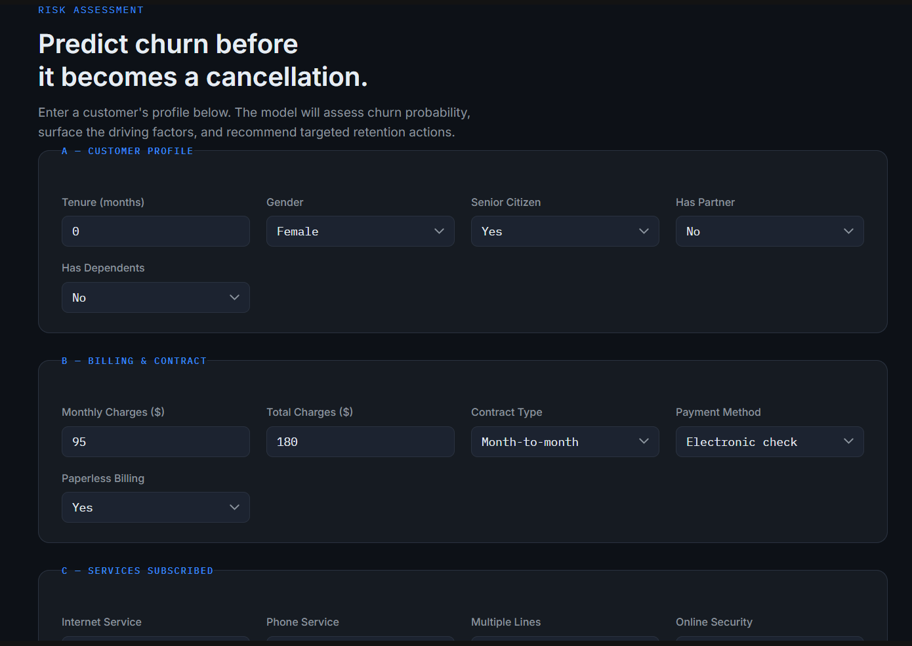
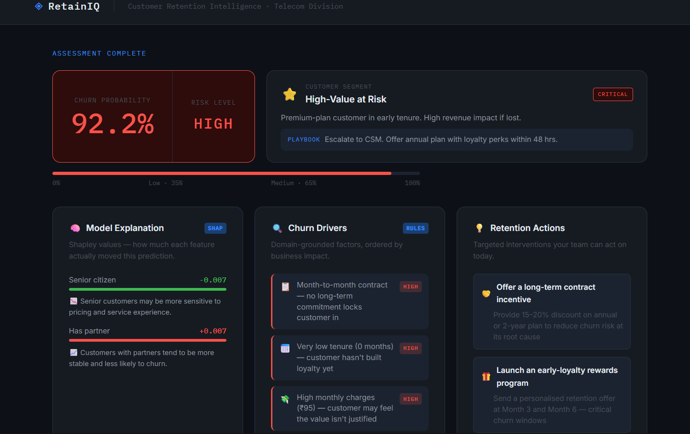
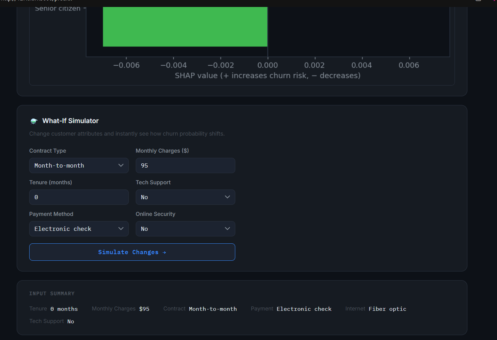

# RetainIQ — Customer Retention Intelligence System

A production-quality ML system for telecom customer churn prediction, featuring SHAP explainability, a what-if simulator, customer segmentation, and a full evaluation pipeline.

Built on the IBM Telco Churn dataset using **scikit-learn, SHAP, Flask, and Gradient Boosting**, RetainIQ helps identify customers likely to churn and recommends actionable retention strategies.

---

## Overview

Customer churn is one of the highest revenue risks for subscription businesses.

RetainIQ predicts whether a telecom customer is likely to churn and explains **why** using SHAP (Shapley values), customer segmentation, and business-grounded retention playbooks.

Instead of returning a raw probability like:

> `Churn Probability = 0.82`

RetainIQ converts predictions into **business decisions**:

> **High-Value at Risk → Escalate to customer success team within 48 hours**

This bridges the gap between **ML prediction** and **business action**.

---

## Key Features

| Feature                   | What it does                                           | Why it matters                                  |
| ------------------------- | ------------------------------------------------------ | ----------------------------------------------- |
| **Churn Prediction**      | Gradient Boosting classifier with tuned threshold      | Optimised for F1 score, not misleading accuracy |
| **SHAP Explainability**   | Per-prediction feature contributions + waterfall chart | Shows what actually influenced the prediction   |
| **Rule-Based Explainer**  | Domain-grounded churn reasons                          | Helps non-technical teams understand risk       |
| **What-If Simulator**     | Modify customer profile and compare probability        | Lets retention teams test interventions         |
| **Customer Segmentation** | Labels customers into churn personas                   | Makes predictions operationally useful          |
| **Threshold Tuning**      | Optimised decision threshold                           | Improves churn recall over default 0.5          |
| **Evaluation Pipeline**   | ROC, PR curve, confusion matrix, SHAP summary          | Demonstrates model reliability                  |

---

## Demo

### Example Prediction

```text
Customer Risk:    HIGH (82%)
Segment:          High-Value at Risk [CRITICAL]

Top Drivers:
- Month-to-month contract
- Low tenure (4 months)
- High monthly charges
- No online security
- Electronic check payment

Recommended Actions:
- Offer long-term contract incentive
- Launch early loyalty program
- Provide discounted bundle
- Offer Tech Support + Security trial
```


```md




```

---

## Architecture

```text
                    ┌────────────────────────────────────┐
  HTML Form  ──────▶│ Flask (app.py)                     │
                    │ POST /predict                      │
                    │ POST /whatif (simulator)           │
                    └─────────┬──────────────────────────┘
                              │
              ┌───────────────┼─────────────────┐
              ▼               ▼                 ▼
       predictor.py      explainer.py    segmentation.py
       (ML inference)    (rules engine)  (customer personas)
              │
              ▼
       shap_utils.py
       (SHAP values +
        waterfall chart)
              │
              ▼
    ┌─────────────────────────────┐
    │ model/                      │
    │ best_model.pkl              │
    │ scaler.pkl                  │
    │ feature_columns.pkl         │
    │ scale_cols.pkl              │
    │ threshold.pkl               │
    │ shap_explainer.pkl          │
    └─────────────────────────────┘
```

---

## Model Performance

| Model                 |  F1 Score |   ROC-AUC | Precision |    Recall |
| --------------------- | --------: | --------: | --------: | --------: |
| Logistic Regression   |     ~0.60 |     ~0.84 |     ~0.65 |     ~0.56 |
| Random Forest         |     ~0.62 |     ~0.82 |     ~0.67 |     ~0.58 |
| **Gradient Boosting** | **~0.64** | **~0.85** | **~0.68** | **~0.60** |

**Why F1 over Accuracy?**

The IBM Telco dataset is **imbalanced (73/27)**.

A model predicting **“No Churn” for everyone** would already achieve ~73% accuracy.

To avoid misleading metrics, RetainIQ optimises for:

* **F1 Score** → balances precision and recall
* **Recall ≥ 70% target** → missing churners is expensive in business settings

Threshold tuning improves real churn detection compared to the default `0.5` threshold.

---

## Engineered Features

Three domain-driven features were engineered to improve prediction quality.

| Feature                 | Formula                               | Business Signal                         |
| ----------------------- | ------------------------------------- | --------------------------------------- |
| `charges_per_tenure`    | `MonthlyCharges / (tenure + 1)`       | High spend early → dissatisfaction risk |
| `num_services`          | Count of service subscriptions        | More services → stickier customer       |
| `is_high_value_at_risk` | `MonthlyCharges > 70 AND tenure < 12` | Premium-paying customer in early tenure |

---

## Customer Segments

RetainIQ converts probability into operational categories.

| Segment                     | Urgency  | Trigger                                  |
| --------------------------- | -------- | ---------------------------------------- |
| 🔴 High-Value at Risk       | Critical | High charges + early tenure + high churn |
| 🟠 Price-Sensitive Churner  | High     | Expensive plan + month-to-month          |
| 🟠 New Disengaging Customer | High     | Low tenure + few services                |
| 🟠 Contract Cliff Risk      | High     | Month-to-month + elevated churn          |
| 🟡 Senior at Risk           | Medium   | Senior citizen + elevated churn          |
| 🟡 Low-Engagement Customer  | Medium   | Long tenure + low service usage          |
| 🟢 Stable Customer          | Low      | No major churn indicators                |

---

## Business Impact

RetainIQ is designed to help retention teams take action **before churn happens**.

Potential business use-cases:

* Flag high-risk customers early
* Prioritise premium customers for escalation
* Test retention interventions using simulation
* Explain predictions to non-technical stakeholders
* Translate ML output into customer success workflows

Instead of acting on:

> `0.74 churn probability`

teams can act on:

> **“Price-Sensitive Churner → Offer 3-month discount bundle”**

---

## Engineering Challenges

Some challenges encountered during development:

* Handling **SHAP output inconsistencies** across model types and versions
* Aligning preprocessing pipeline with feature explainability
* Balancing precision vs recall on an imbalanced dataset
* Translating ML predictions into actionable business recommendations
* Designing a simulator that recalculates churn probability dynamically

---

## Project Structure

```text
customer-retention-intelligence/
│
├── data/
│   ├── telco_churn.csv
│   └── eval/
│
├── notebooks/
│   └── eda_and_training.ipynb
│
├── model/
│   ├── best_model.pkl
│   ├── scaler.pkl
│   ├── feature_columns.pkl
│   ├── scale_cols.pkl
│   ├── threshold.pkl
│   └── shap_explainer.pkl
│
├── app/
│   ├── app.py
│   ├── predictor.py
│   ├── explainer.py
│   ├── shap_utils.py
│   ├── segmentation.py
│   ├── templates/
│   └── static/
│
├── evaluate.py
├── requirements.txt
└── README.md
```

---

## Setup & Run

```bash
# Clone repository
git https://github.com/shruti985/customer-retention-intelligence
cd customer-retention-intelligence

# Create virtual environment
python -m venv venv

# Activate environment
# Windows
venv\Scripts\activate

# Mac/Linux
source venv/bin/activate

# Install dependencies
pip install -r requirements.txt

# Add dataset
# Place telco_churn.csv inside:
# data/telco_churn.csv

# 4. Train the model
python eda_and_training.py

# Run evaluation
python evaluate.py

# Start app
cd app
python app.py
```

Open:

```text
http://localhost:5000
```

---

## Tech Stack

* **Python**
* **scikit-learn**
* **SHAP**
* **Flask**
* **Pandas / NumPy**
* **Matplotlib**
* **Jupyter Notebook**

---

## Future Improvements

* Docker deployment
* PostgreSQL prediction logging
* User authentication
* Drift monitoring
* A/B testing for retention interventions
* Personalised retention messaging

---

## Dataset

IBM Telco Customer Churn Dataset

* **7,043 rows**
* **21 features**
* **Binary classification (Churn: Yes / No)**

Source:

https://www.kaggle.com/datasets/blastchar/telco-customer-churn

---

## Author

Built by **Shruti Jain** as an end-to-end applied ML + product engineering project focused on explainable AI for customer retention.
